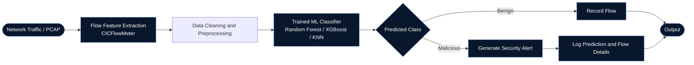

```mermaid
flowchart LR
    A([Network Traffic / PCAP]) --> B[Flow Feature Extraction<br/>CICFlowMeter]
    B --> C[Data Cleaning and Preprocessing]
    C --> D[Trained ML Classifier<br/>Random Forest / XGBoost / KNN]
    D --> E{Predicted Class}
    E -->|Benign| F[Record Flow]
    E -->|Malicious| G[Generate Security Alert]
    G --> H[Log Prediction and Flow Details]
    F --> I([Output])
    H --> I

    style A fill:#09172c,stroke:#1e4b91,color:#ffffff
    style B fill:#09172c,stroke:#1e4b91,color:#ffffff
    style D fill:#09172c,stroke:#1e4b91,color:#ffffff
    style E fill:#09172c,stroke:#1e4b91,color:#ffffff
    style F fill:#09172c,stroke:#1e4b91,color:#ffffff
    style G fill:#09172c,stroke:#1e4b91,color:#ffffff
    style H fill:#09172c,stroke:#1e4b91,color:#ffffff
    style I fill:#09172c,stroke:#1e4b91,color:#ffffff
```